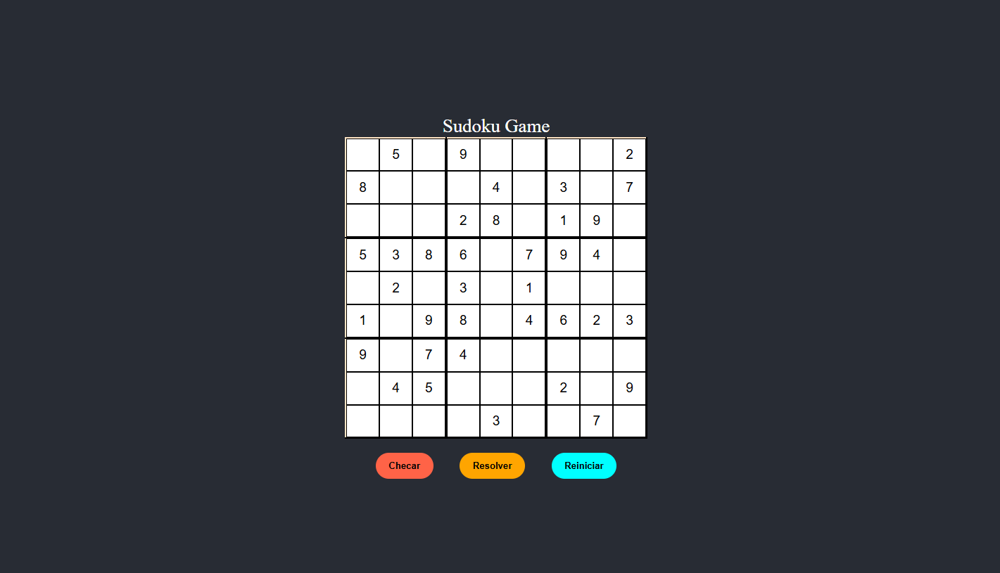

# Sudoku


Jogo Sudoku criado com o Vite e desenvolvido com React e JavaScript. O projeto contém manipulação de array e estrutura de repetição, além das funções que dão funcionalidades aos botões. 
- Disponível em: https://jogo-sud-oku.netlify.app/

## 📥 Instalação
Clone o repositório e instale as dependências:
```
git clone https://github.com/luisafalquetoz/sudoku.git
cd sudoku
npm install
```

### Desenvolvimento
Execute o servidor de desenvolvimento:
```
npm run dev
```

## 📬 Contato
Caso tenha dúvidas ou sugestões, entre em contato:

Nome: Luisa Falqueto

E-mail: luisafzandonade@gmail.com

LinkedIn: [LinkedIn](https://www.linkedin.com/in/luisa-falqueto/)

GitHub: [GitHub](https://github.com/luisafalquetoz)
